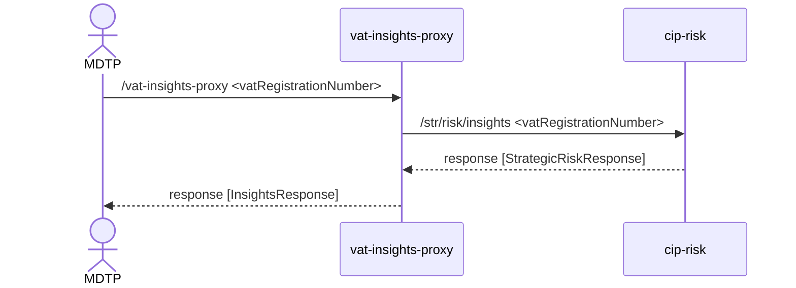

# vat-insights-proxy

This service provides the ability to return risking insights for a VAT registration number. It acts as a proxy to CIP backend services in order to retrieve strategic risk scores and related information for VAT numbers, supporting decision-making and risk assessment processes.

## Sequence Diagram


## Required Headers

Requests to this service must include the following HTTP headers:

- `User-Agent`: Identifies the client making the request. Example: `User-Agent: vat-registration-frontend`
- `Content-Type`: Must be set to `application/json` for JSON payloads.

## Optional Headers

- `X-Correlation-Id`: A unique identifier for tracing requests through the system. Example: `X-Correlation-Id: <uuid>`

## Example Request and Response

A typical request to the service might look like:

```json
{
  "vatRegistrationNumber": "GB123456789"
}
```

A typical response from the service might look like:

```json
{
  "attributeType": "VAT_REGISTRATION_NUMBER",
  "attributeValue": "GB123456789",
  "insights": {
    "strategicRisk": {
      "riskCorrelationId": "180a7587-3b80-40e6-b907-ea641dccbe11",
      "riskScore": 83.33,
      "reasons": [
        "VRN 'GB123456789' is 1 hops from something risky. The average VRN is 2.51 hops from something risky."
      ],
      "riskData": [
        {
          "hops": 1,
          "avgHops": 2.51
        }
      ]
    }
  }

```

## Unit testing
To run the unit tests for the application, use the following command:

```sbt test ```


## Integration testing
The integration tests depends on external services such as a Postgres database and AWS Secrets Manager. These tests
make use of TestContainers to spin up the required dependencies in Docker containers.

To run the integration tests, use the following command:

```sbt it/test```

## Code coverage

```sbt clean coverage test it/test coverageReport```

## Running locally
To run the service locally, you can use the following command:

```./run_local.sh```

## Test-Only Endpoints
This service provides test-only endpoints designed exclusively for development and testing. These endpoints must not be used in production environments.
The test-only routes enable you to create risk data for a given VAT registration number to validate service behavior across different scenarios

For full details on available endpoints—including request/response formats and required parameters—refer to the https://github.com/hmrc/cip-risk/blob/main/testOnly.md.

*Note:*
The test-only endpoints use a slightly different URL structure compared to the main cip-risk API.
For example:

The main cip-risk API documents the endpoint as:
* POST /test-only/str/vertex-data

The equivalent test-only endpoint in this service becomes:
* POST /test-only/cip-risk/str/vertex-data

## License

This code is open source software licensed under the [Apache 2.0 License]("http://www.apache.org/licenses/LICENSE-2.0.html").